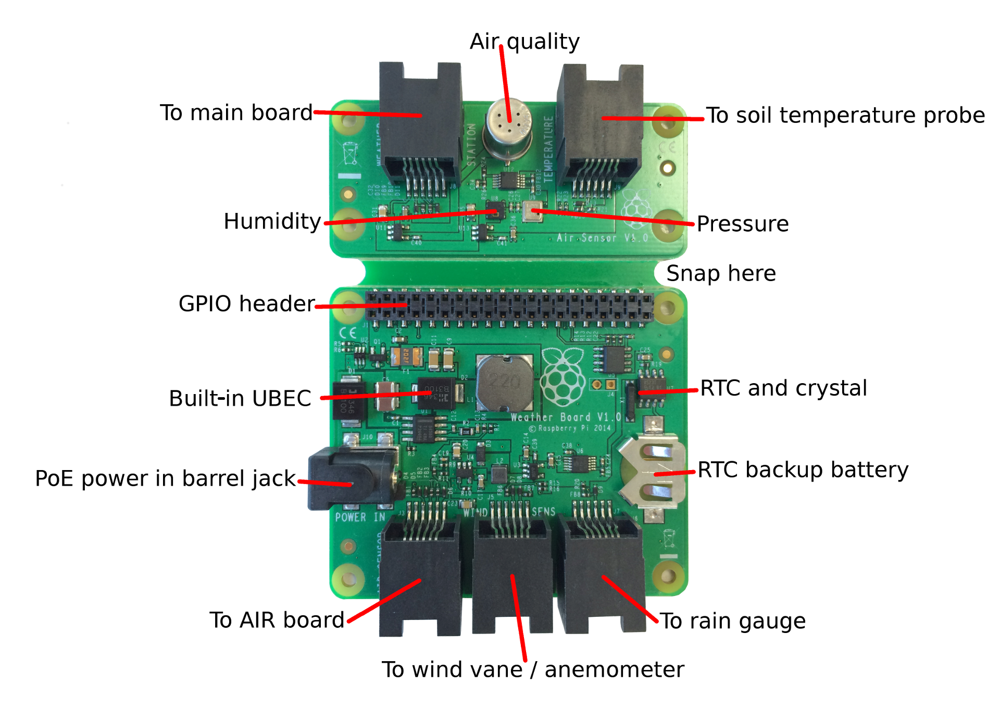

## Introduction

This project takes you through all the steps needed to assemble, program and install an Oracle Raspberry Pi Weather station. These kits were sent to schools in 2015 & 2016. If you don't have one of these kist and are looking to build your own weather station, then please look at this [project](https://projects.raspberrypi.org/en/projects/build-your-own-weather-station) instead.

### What you will make

A labelled diagram of the Weather HAT

--- print-only ---

--- /print-only ---

--- collapse ---
---
title: What you will need
---
### Hardware

+ An Oracle Raspberry Pi Weather station kit

### Software

+ This project will take you through all the steps needed to install the required packages and libraries.
+ The weather station software repository

### Tools

+ Flat head screwdriver
+ Small Phillips screwdriver
+ Pliers
+ Scalpel or sharp knife
+ Duct tape or electricians tape

### Downloads

+ [rpf.io/project-name-go](http://rpf.io/project-name-go){:target="_blank"}

--- /collapse ---

--- collapse ---
---
title: What you will learn
---

+ Two or three learning objectives
+ ...should go here

--- /collapse ---

--- collapse ---
---
title: Additional information for educators
---

If you need to print this project, please use the [printer-friendly version](https://projects.raspberrypi.org/en/projects/project-name/print){:target="_blank"}.

[Here is a link to the resources for this project](http://rpf.io/project-name-go).

--- /collapse ---
