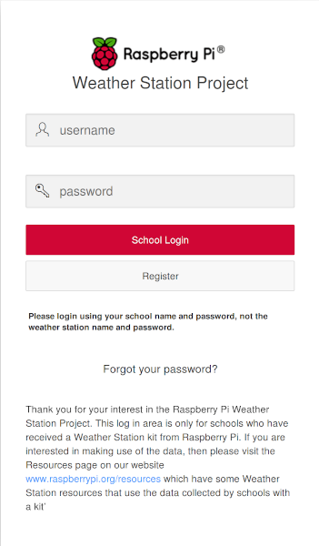
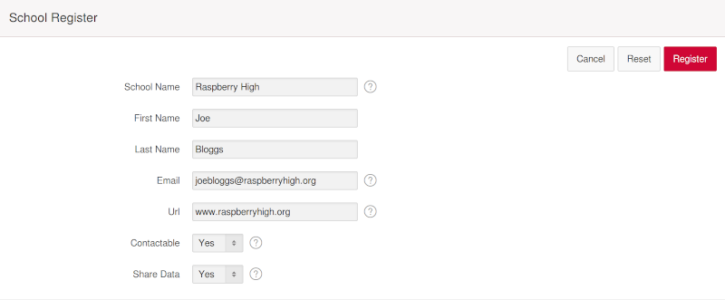
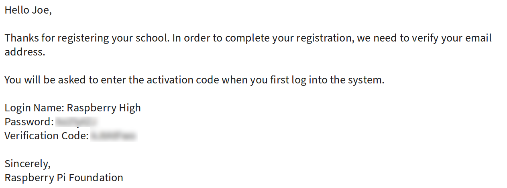
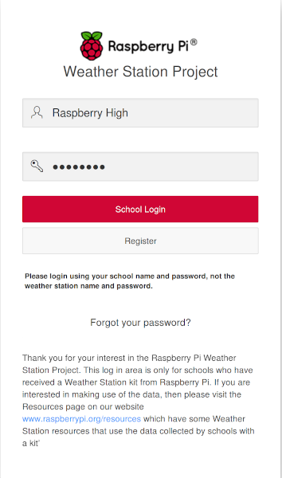
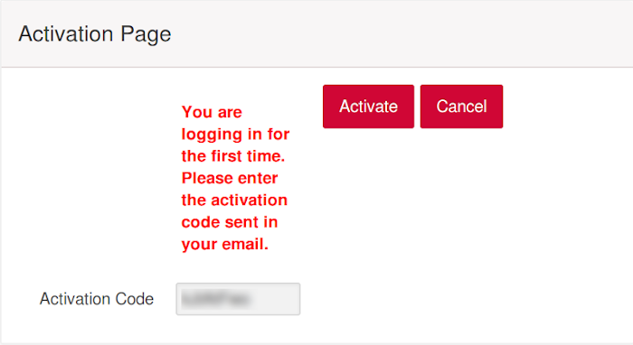
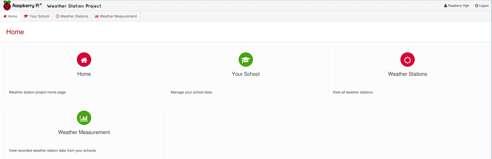
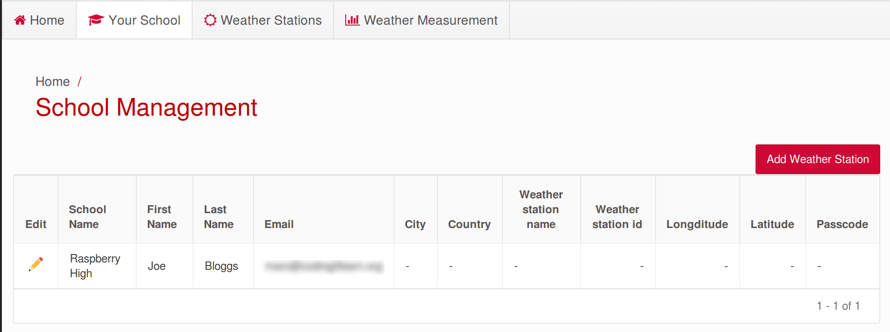
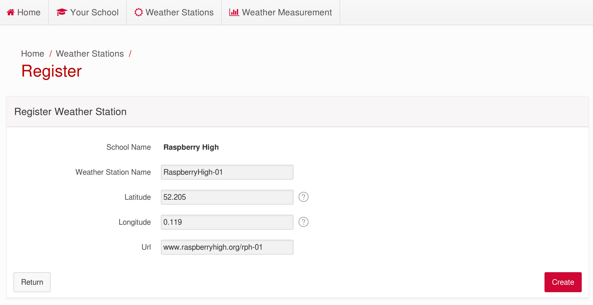

## Register your Weather Station

If you have a Raspberry Pi Oracle Weather Station, then your first task will be to register your school and Weather Station on the Raspberry Pi online Oracle database. This is where your weather station will upload data.

## Register your school

1. Navigate to the [Raspberry Pi Oracle database](https://apex.oracle.com/pls/apex/f?p=81290:LOGIN_DESKTOP:0:::::&tz=1:00), and click  the **Register** button.
   

1. Fill in your details, including your organisation's web address (URL) and whether you permit the Raspberry Pi Foundation to contact you. If you are not the person who originally applied for the Weather Station and/or no longer have access to the email address used for the application, then we may not be able to find your details in our records. Please email weather@raspberrypi.org for help.

   

1. You may have to wait a couple of days for your registration to go through. You will receive an email from us once you have been registered on the database (please check your spam folder too, just in case).

   

1. Go back to the [Raspberry Pi Oracle database](https://apex.oracle.com/pls/apex/f?p=81290:LOGIN_DESKTOP:0:::::&tz=1:00) and log in with your school's name and password.

   

1. The next page will ask for your activation code, which is included in the email sent to confirm your registration.

   

1. Click on **Activate**, then you will be taken to your dashboard.

   

## Register your Weather Station

1. Click on **Your School** on your dashboard.

1. You will be taken to your school's data page. To create a new Weather Station, click on **Add Weather Station**.

   

1. Complete the details for your Weather Station. You can choose any name you like, although it is probably best to keep it fairly short.

   

1. Longitude and latitude are used to identify the location of your Weather Station. Latitude specifies the north–south position of a point on the Earth's surface. Longitude specifies the east-west position of a point on the Earth's surface. To find your longitude and latitude, if you don't already know it, you can use Google Maps: search for your address, then right-click on the marker that appears and select **What's here?**. The longitude and latitude will then be shown at the bottom of the screen. The first number is the latitude and the second is the longitude.

   

1. When you have completed all of the fields, click on **Create**. The next screen will show your Weather Station. **Note:** You should make a note of the passcode, as you will need it when you set up your Weather Station.

1. You will now see your Weather Station displayed on the **Your School** tab. The data shown will also include your Weather Station's passcode, if you ever need to look it up.

