## Assemble your Weather Station

### Set up the Weather Station HAT

1. Your Raspberry Pi Weather Station should arrive in a sleeved box.

   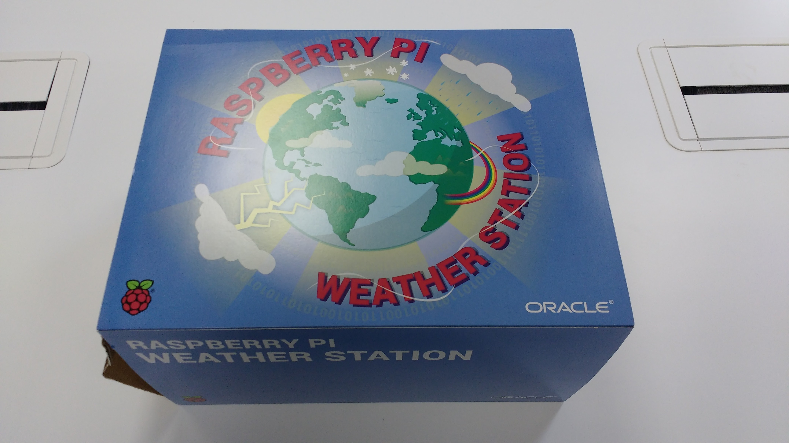

1. Open the box and remove its contents.

   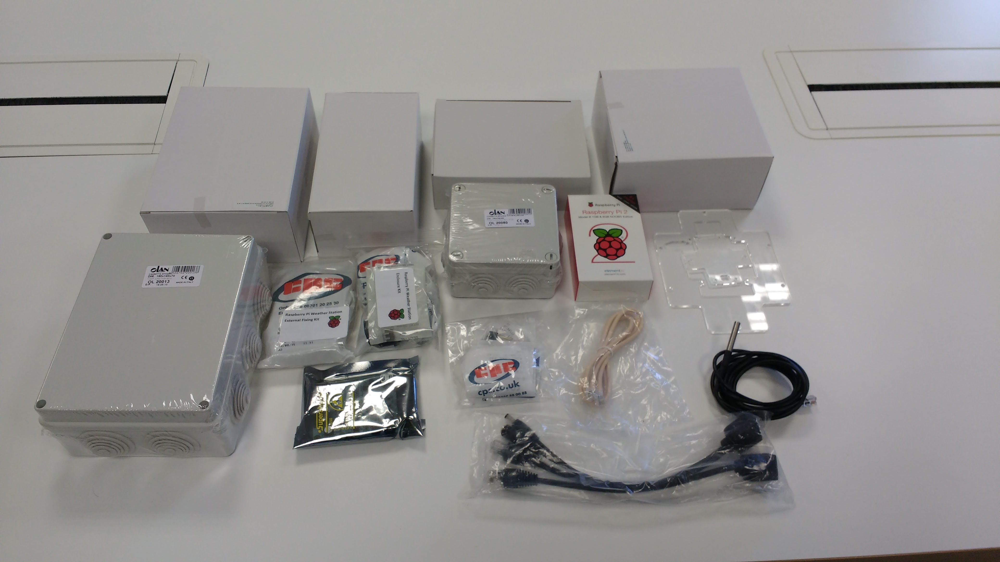

1. Remove the Raspberry Pi from its box and place it on to its acrylic base as shown below.

   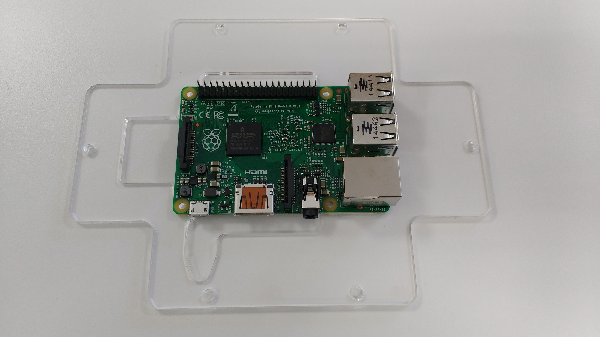

1. Remove the contents of the board mounting kit.

   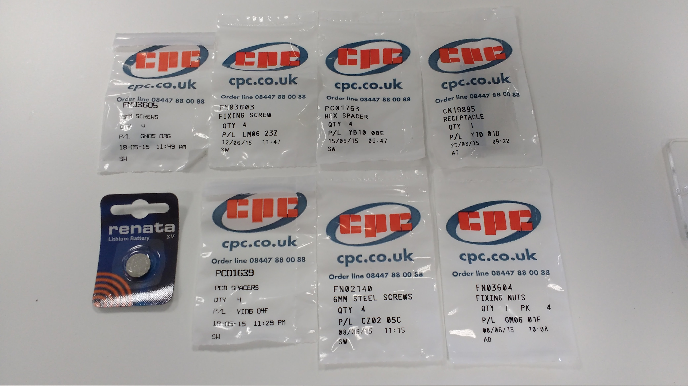

1. Use the four 8mm screws and the four hex spacers to affix the Raspberry Pi to its acrylic base. Then, place the tall header (CN19895 receptacle) over the Raspberry Pi's GPIO pins.

   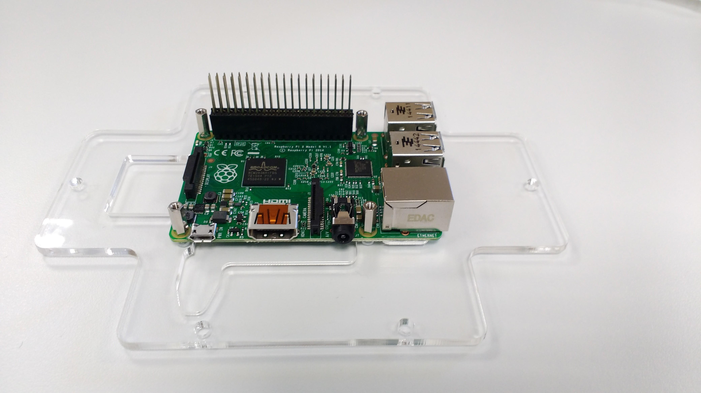

1. Next, take the weather board and air sensor board, which are connected.

   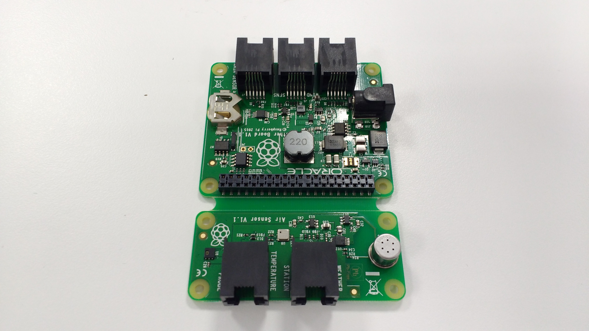

1. Use a pair of pliers to separate the two boards.

   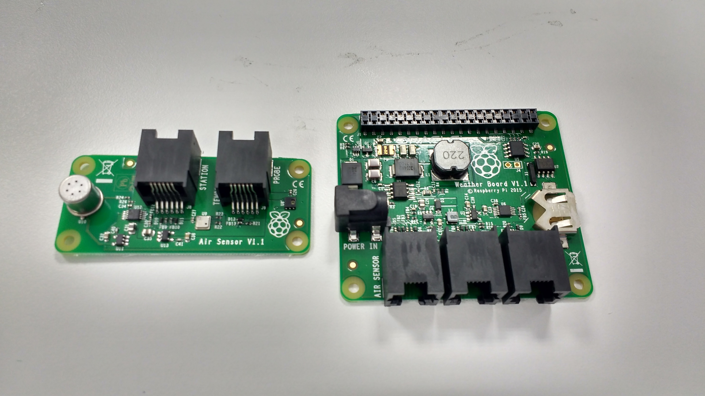

1. Insert the coin cell battery into the weather board.

   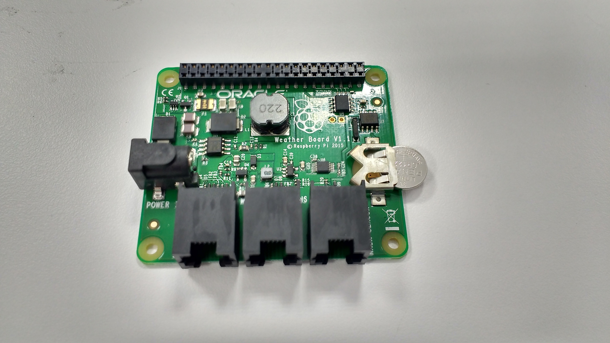
   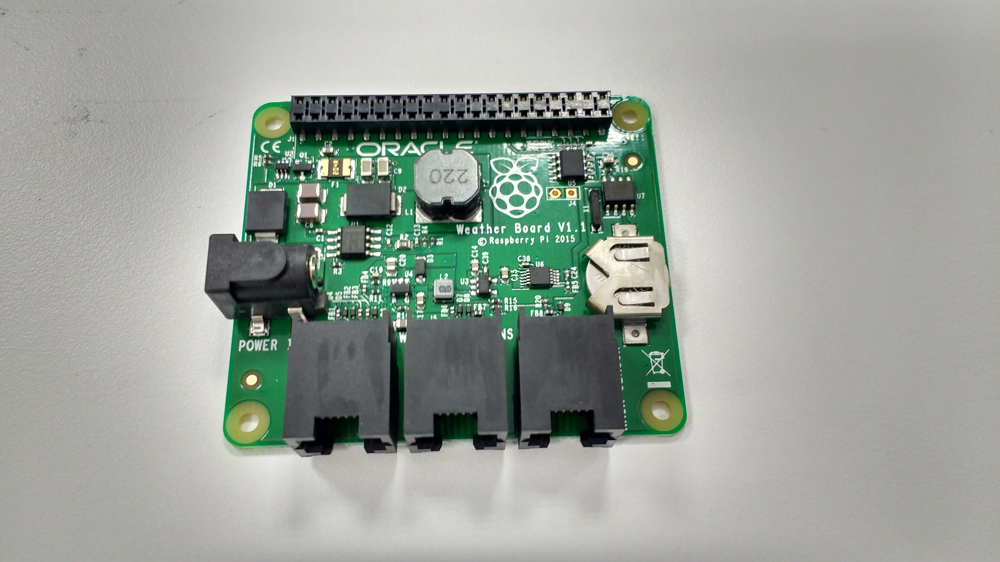

1. Place the weather board over the Raspberry Pi, making sure that the mount on the weather board aligns with the pins of the tall header.

   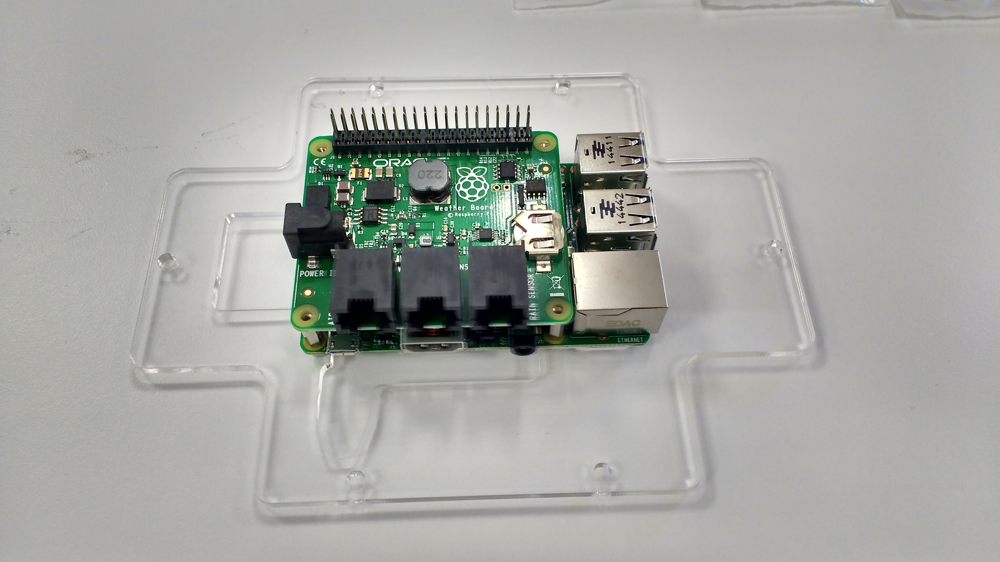

1. Use the four 6mm screws to secure the weather board to the Raspberry Pi.

   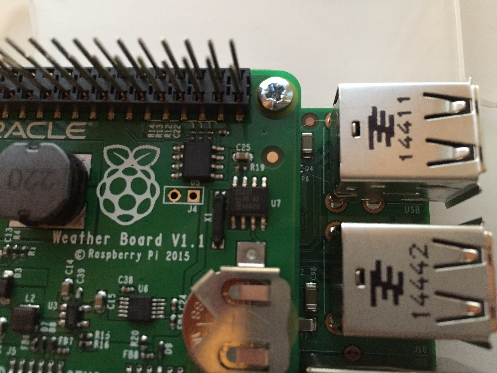

1. Place a plastic card (e.g. a credit card) between the pins on the header to angle each row of pins outwards a little, to ensure that a good contact is made.

   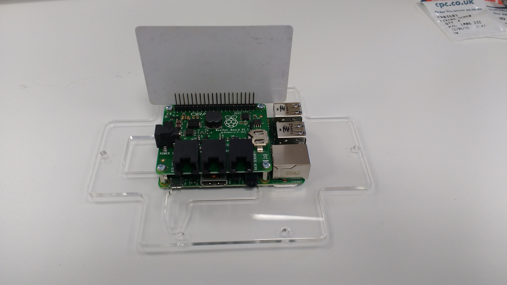
   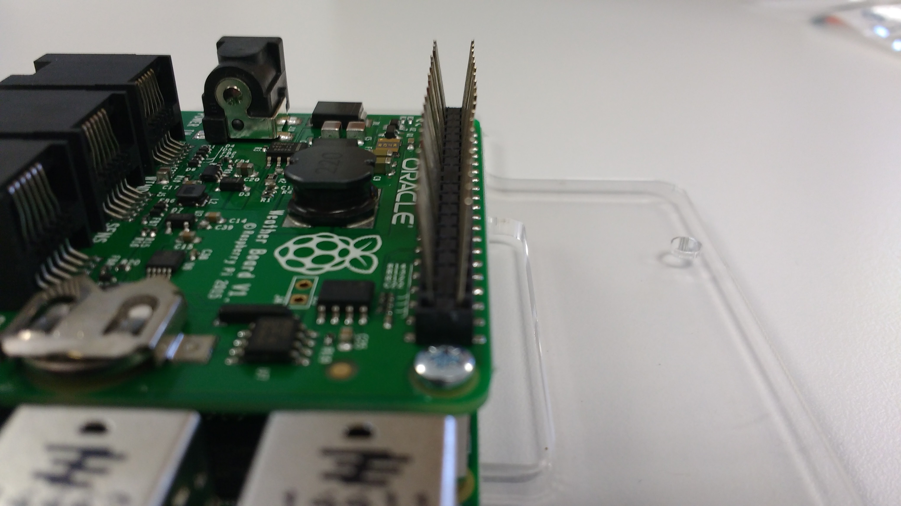

### Power up the Raspberry Pi

1. You can now plug a keyboard, mouse, Ethernet cable, and HDMI cable into the Raspberry Pi.

   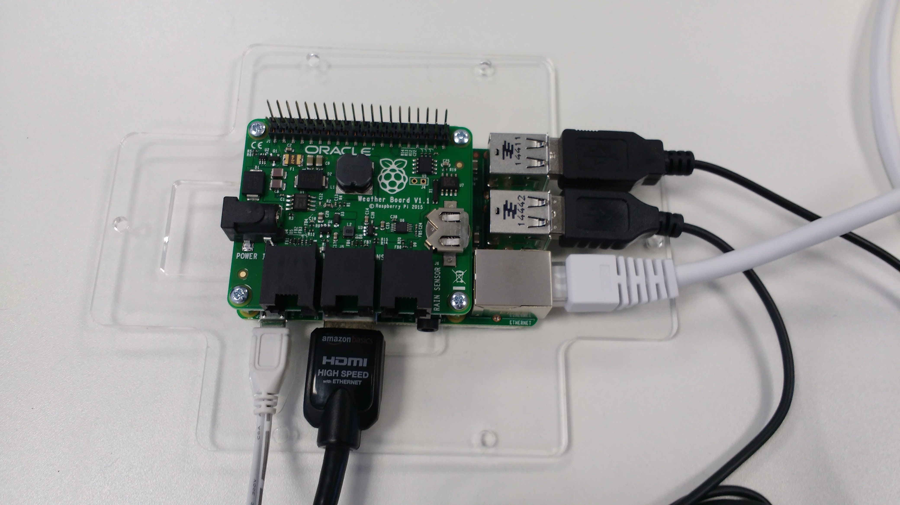

1. To power your Raspberry Pi, you could use a standard 5V power supply or the power over Ethernet (PoE) kit, which is included.

   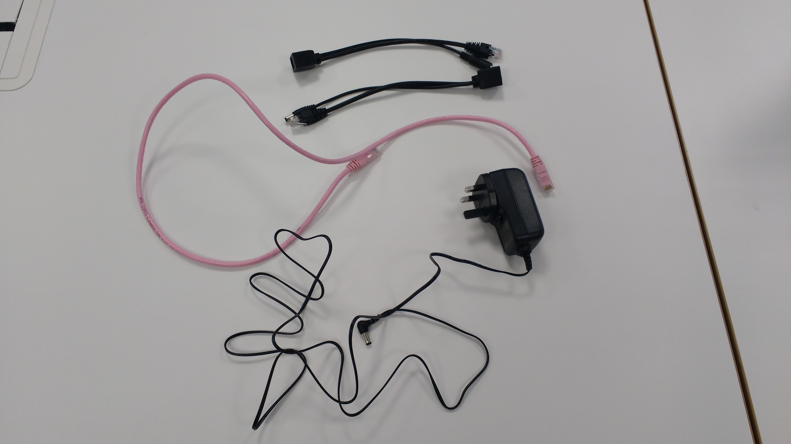

1. Connect an Ethernet cable (not included) to the two PoE adapters. Plug the power supply into the appropriate adapter.

   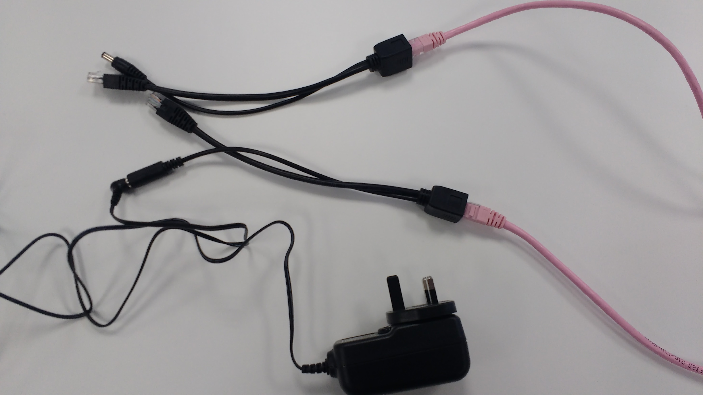

1. Plug the relevant adapter into the Raspberry Pi as shown below. You can connect the other end to a network point and a wall socket.

   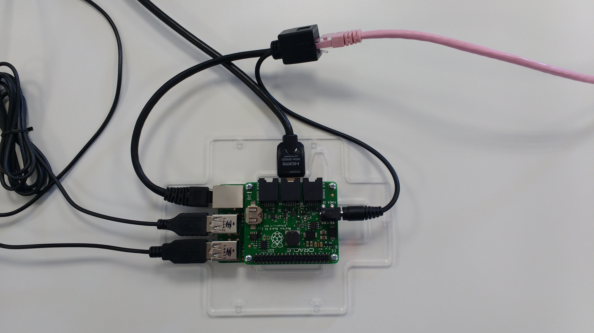
