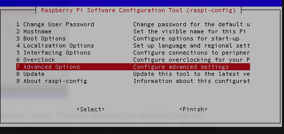
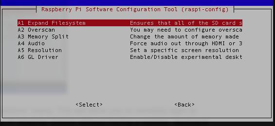
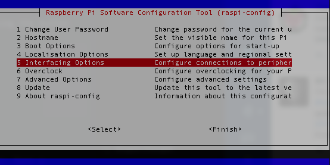
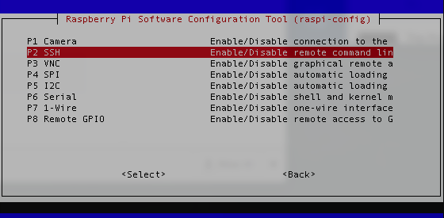
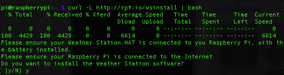
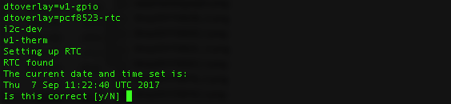
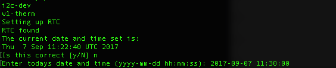
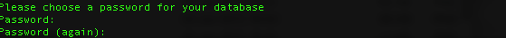
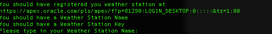

## Installing the software

The Weather Station software has two main elements. The first is the collection of drivers and scripts that are needed to communicate with the various weather sensors. The second is the local MariaDB database that is used to store all the data produced by the sensors. This data is regularly uploaded to our online Oracle database so that it can be analysed and compared with all the other Weather Stations from around the world.

Before continuing, please ensure that you have registered your School and Weather Station on the Oracle database as described in step 2.

The entire software installation process can take a while, especially if you have a slow Internet connection. If you're planning to carry out the installation as part of a lesson or club, it is probably a good idea to download everything you need (especially SD card images), burn the SD card and perform any software updates **before** the session.

There are three ways to install the software. Each has its advantages and disadvantages. We recommend that you read through each method before deciding which one is best for you.

### Method 1: Pre-built SD card image

In some ways this is the easiest method, however there are some disadvantages:
- The image will not be updated for every new Raspbian release so the update/upgrade process (step 2) may take longer. The current image is based on Raspbian Stretch.
- Any hardware problems may be much harder to diagnose. Using either of the other methods is much more likely to reveal individual errors and make them simpler to correct. If you contact Weather Station support with problems having used the pre-built image, you will probably be asked to try again using the more manual methods.
- The image is intended to be run on a Raspberry Pi 2 (the model that shipped with the kit) or a Pi 3. If you're using something else (an older Pi or a Pi Zero), it will not work without some tinkering. It will not work on a raspberry Pi model 4 (which requires Raspbian Buster).
- The image is based on the stripped-down 'lite' build of Raspbian. Therefore it does not have any graphical software such as LibreOffice installed and all configuration (e.g. connecting to a wifi network) will have to be performed using the command line and by editing text files.  

To use the image, do the following:

1. Download the [Weather Station image](http://downloads.raspberrypi.org/weather_station/images/weather_station-2017-09-13/2017-09-weather-station.zip) and [burn it](https://www.raspberrypi.org/documentation/installation/installing-images/) to your SD card.

1. Connect the Pi to the Internet. Login with the standard username and password (pi/raspberry) and run

    ```bash
    sudo sudo apt-get update && sudo apt-get upgrade -y
    ```
1. Modify the **credentials.oracle** file in the weather-station directory and replace ‘*blank*’s with your Oracle database Weather Station name and passcode.

1. In order to ensure that you don't rapidly run out of disk space, run:
    ```bash
    sudo raspi-config
    ```
    

1. Then select 'Advanced Options' followed by 'Expand Filesystem'.

    

1. Make sure all the sensors are connected.

### Method 2: One-line installer

#### Getting the latest Raspberry Pi OS

1. The SD card that was originally shipped with the Weather Station kit contains a version of Raspbian, the Raspberry Pi operating system, which is now extremely out of date and should not be used.

1. Follow the [guide on the Raspberry Pi website](https://www.raspberrypi.org/documentation/installation/installing-images/) which tells you how to install the latest version of Raspbian. You can use either Desktop version or the slimmer 'Lite' one. The latter is a smaller download as it does *not* include LibreOffice, Wolfram and many other packages which are not required for operation of the Weather Station. However, it is command-line only, and therefore all configuration is performed through this interface. There is no GUI.  

#### Setting up the Weather Station software.

1. When Raspbian boots up, press **Ctrl** and **Alt** and the character **t** on your keyboard. This will open up a Terminal window. [Desktop Raspbian only]

1. Type

    ```bash
    sudo raspi-config
    ```

    

1. Now enable [Secure Shell access](https://www.raspberrypi.org/blog/ssh-shenanigans/) from the "Interfacing Options" menu. This will allow you to remotely login to your Pi via the network. In this way you can work on your Pi Weather Station without having a monitor, keyboard and mouse attached.


    

1. Still in the Terminal, type:

```bash
sudo apt update
```

This will discover what new software is available for your Pi. Next you can install the updates

1. Type:
 ```bash
sudo apt upgrade -y
```

1. Once the updates have been instaleld, reboot the Pi by typing:

```bash
sudo Reboot
```

1. Once the Pi has restarted, login again (and if you're using the Desktop version, open a Terminal).  Now run the one-line installer.  Type (or copy and paste) the following line.

	```bash
	curl -L http://rpf.io/wsinstall | bash
	```

1. You can now proceed through the installation process. When prompted, press **y** to continue.

    

1. The first part of the installation is to update any packages that may have been upgraded by their developers since the Raspbian image was built. Note that sometimes during the `update` and `upgrade` process you may be prompted as to whether you would like certain pieces of software to be installed or certain settings to be changed.
It is normally fine to accept the default answer, but always read the request carefully.

1. The Real Time Clock (RTC) is configured next. If the time displayed is correct, type **y** as prompted.

    

1. If the time is *incorrect*, type **n** and then enter the correct time in the format `yyyy-mm-dd hh:mm:ss`.

    

1.  Next you will need to choose a database password. It can be anything you like, as it is the password for the local MariaDB database on your Raspberry Pi. Write the password down somewhere so you do not forget it.

    

1. The MariaDB packages will now be installed. This will provide the local database on your Pi for storing your weather data.

1. Next you need to type in the Weather Station name and password/key that you obtained when you [registered](https://www.raspberrypi.org/learning/weather-station-guide/register.md) your Weather Station with the online Oracle database.

    

1. That's it. Once the install has finished, your Raspberry Pi should reboot.

### Method 3: Manual step-by-step installation

1. Although the simplest way to perform the software installation process is to use our one-line install script, the benefit of setting it up manually is that you'll learn about the workings of the sensors and the station as you do it. If you wish to proceed manually through the steps, then you can follow the steps below. Note that this is only recommended if you're happy using the command line interface, or want to make custom adjustments to your setup.

# Setting up the Raspberry Pi Weather Station software manually.

You don't need any prior knowledge to set up the Weather Station. There are several steps, but the benefit of setting up manually is that you'll learn about the workings of the sensors and the station as you do it. You'll also be introduced to the command line interface, the text editor nano and the MariaDB database. It's also a great introduction to Linux.


## Manual installation

1.  Start with a fresh install of the latest version of [Raspbian](https://www.raspberrypi.org/downloads/raspbian/). You can either use the Desktop versions, or the slimmer 'lite' version.

1.  When booting for the first time, you will be presented with the desktop (or a login prompt if you're using the 'lite' version).

1.  If you're using the Desktop version, from the Menu button in the top left-hand corner choose `Preferences` > `Raspberry Pi Configuration`. Otherwise log in and type

```bash
sudo raspi-config
```

1. We recommend that you **change your password**.

1. In the Interfaces tab, enable I2C:

    

1. A reboot dialogue will appear. Select Yes.

## Setting up the real-time clock

We'll be doing most of the work from the command line. If you're using the Desktop version, open a terminal window using the icon on the menu bar or by pressing `ctrl`+`alt`+`t`.

   

You'll now be at a prompt:

```bash
pi@raspberrypi: ~ $
```

You can type the commands which follow into this prompt.

First, you'll need to download the necessary files:

```bash
cd ~ && git clone https://github.com/raspberrypi/weather-station
```

We've included an install script to set up the real-time clock automatically. You can run this file or, alternatively, follow the instructions below to set up the RTC manually. We recommend using the install script!

## RTC setup

First, you want to make sure you have all the latest updates for your Raspberry Pi:

```bash
sudo apt-get update && sudo apt-get upgrade
```

You now need to make some changes to a config file to allow the Raspberry Pi to use the real-time clock:

```bash
sudo nano /boot/config.txt
```

Add the following lines to the bottom of the file:

```bash
dtoverlay=w1-gpio
dtoverlay=pcf8523-rtc
```

Press `Ctrl`+`O` then Enter to save, and `Ctrl`+`X` to quit nano.

Now set the required modules to load automatically on boot:

```bash
sudo nano /etc/modules
```

Add the following lines to the bottom of the file:

```bash
i2c-dev
w1-therm
```

Press `Ctrl`+`O` then Enter to save, and `Ctrl`+`X` to quit nano.

For the next steps, we need the Weather Station HAT to be connected to the Raspberry Pi:

```bash
sudo halt
```

Reboot for the changes to take effect:

```bash
sudo reboot
```

Check that the real-time clock (RTC) appears in `/dev`:

```bash
ls /dev/rtc*
```

You should see something like `/dev/rtc0`.

## Initialise the RTC with the correct time

Use the `date` command to check that the current system time is correct. If it's correct, then you can set the RTC time from the system clock with the following command:

```bash
sudo hwclock -w
```

If not, you can set the RTC time manually using the command below (you'll need to change the `--date` parameter, as this example will set the date to the 1st of January 2014 at midnight):

```bash
sudo hwclock --set --date="yyyy-mm-dd hh:mm:ss" --utc
```

For example:

```bash
sudo hwclock --set --date="2015-08-24 18:32:00" --utc
```

Then set the system clock from the RTC time:

```bash
sudo hwclock -s
```

Now you need to enable setting the system clock automatically at boot time. First, edit the rule in `/lib/udev/`:

```bash
sudo nano /lib/udev/hwclock-set
```

Find the lines at the bottom that read:

```bash
if [ yes = "$BADYEAR" ] ; then
    /sbin/hwclock --rtc=$dev --systz --badyear
else
    /sbin/hwclock --rtc=$dev --systz
fi
```

Change the `--systz` options to `--hctosys` so that they read:

```bash
if [ yes = "$BADYEAR" ] ; then
    /sbin/hwclock --rtc=$dev --hctosys --badyear
else
    /sbin/hwclock --rtc=$dev --hctosys
fi
```

Press `Ctrl`+`O` then Enter to save, and `Ctrl`+`X` to quit nano.

## Remove the fake hardware clock package

Use the following commands to remove the fake hardware clock package:

```bash
sudo update-rc.d fake-hwclock remove
sudo apt-get remove fake-hwclock -y
```

## Testing the sensors

### Install the necessary software packages

Power up your Raspberry Pi and log in.

At the command line, type the following:

```bash
sudo apt-get install i2c-tools python-smbus telnet -y
```

Test that the I2C devices are online and working:

```bash
sudo i2cdetect -y 1
```

You should see output similar to this:

```
	 0  1  2  3  4  5  6  7  8  9  a  b  c  d  e  f
00:          -- -- -- -- -- -- -- -- -- -- -- -- --
10: -- -- -- -- -- -- -- -- -- -- -- -- -- -- -- --
20: -- -- -- -- -- -- -- -- -- -- -- -- -- -- -- --
30: -- -- -- -- -- -- -- -- -- -- -- -- -- -- -- --
40: 40 -- -- -- -- -- -- -- -- -- -- -- -- -- -- --
50: -- -- -- -- -- -- -- -- -- -- -- -- -- -- -- --
60: -- -- -- -- -- -- -- -- UU 69 6a -- -- -- -- --
70: -- -- -- -- -- -- -- 77                         
```

- `40` = HTU21D, the humidity and temperature sensor.
- `77` = BMP180, the barometric pressure sensor.
- `68` = PCF8523, the real-time clock. It will show as `UU` because it's reserved by the driver.
- `69` = MCP3427, the analogue-to-digital converter on the main board.
- `6a` = MCP3427, the analogue-to-digital converter on the snap-off AIR board.

Note: `40`, `77` and `6a` will only show if you have connected the **AIR** board to the main board.

Now that the sensors are working, we need a database to store the data they produce.

## Database setup

Now you'll set up your Weather Station to automatically log the collected weather data. The data is stored on the Pi's SD card using a database system called MariaDB. Once your station is successfully logging data locally, you'll also be able to [upload that data](oracle.md) to a central Oracle Apex database to share it with others.

### Install the necessary software packages

At the command line, type the following:

```bash
sudo apt-get install -y mariadb-server mariadb-client libmariadbclient-dev
sudo apt-get install -y apache2 php5 libapache2-mod-php5 php-mysql
sudo pip3 install mysqlclient
```

If you make a mistake, use the cursor UP arrow to go back to previous lines for editing.

Please note that this will take some time.

### Create a local database within MariaDB

Enter the following:

```bash
sudo mysql
```

You will now be at the MariaDB prompt `MariaDB [(none)]>`. First, create a local database account for the Pi user and assign the necessary privileges. You should also choose a password for this account.

```mysql
create user pi IDENTIFIED by 'password';
grant all privileges on *.* to 'pi' with grant option;
```

Then, create the database:

```mysql
CREATE DATABASE weather;
```

You should now see `Query OK, 1 row affected (0.00 sec)`.

Switch to that database:

```mysql
USE weather;
```

You should see `Database changed`, and your prompt should now be `MariaDB [(weather)]>`.

If MariaDB doesn't do anything when it should, you've probably forgotten the final `;`. Just type it in when prompted and press Enter.

### Create a table to store the weather data

Type the code below, taking note of the following tips:

- Don't forget the commas at the end of the row
- Use the cursor UP arrow to copy and edit a previous line, as many are similar
- Type the code carefully and **exactly** as written, otherwise things will break later
- Use CAPS LOCK!

```
  CREATE TABLE WEATHER_MEASUREMENT(
    ID BIGINT NOT NULL AUTO_INCREMENT,
    REMOTE_ID BIGINT,
    AMBIENT_TEMPERATURE DECIMAL(6,2) NOT NULL,
    GROUND_TEMPERATURE DECIMAL(6,2) NOT NULL,
    AIR_QUALITY DECIMAL(6,2) NOT NULL,
    AIR_PRESSURE DECIMAL(6,2) NOT NULL,
    HUMIDITY DECIMAL(6,2) NOT NULL,
    WIND_DIRECTION DECIMAL(6,2) NULL,
    WIND_SPEED DECIMAL(6,2) NOT NULL,
    WIND_GUST_SPEED DECIMAL(6,2) NOT NULL,
    RAINFALL DECIMAL (6,2) NOT NULL,
    CREATED TIMESTAMP NOT NULL DEFAULT CURRENT_TIMESTAMP,
    PRIMARY KEY ( ID )
  );
```

You should now see `Query OK, 0 rows affected (0.05 sec)`.

Press `Ctrl`+`D` or type `exit` to quit MariaDB.

## Set up the sensor software

Begin by downloading the data logging code. You can skip this step if you have set up the [real-time clock](software-setup.md).

```
cd ~
git clone https://github.com/raspberrypi/weather-station.git
```

This will create a new folder in the home directory called `weather-station`.

### Start the Weather Station daemon and test it

A daemon is a process that runs in the background. To start the daemon we need for the Weather Station, use the following command:

```bash
sudo ~/weather-station/interrupt_daemon.py start
```

You should see something like `PID: 2345` (your number will be different).

A continually running process is required to monitor the rain gauge and the anemometer. These are reed switch sensors, and the code uses interrupt detection. These interrupts can occur at any time, as opposed to the timed measurements of the other sensors. You can use the **telnet** program to test or monitor the daemon, with the following command:

```bash
telnet localhost 49501
```

You should see something like this:

```
Trying 127.0.0.1...
Connected to localhost.
Escape character is '^]'.
OK
```

The following text commands can be used:

- `RAIN`: displays rainfall in ml
- `WIND`: displays average wind speed in kph
- `GUST`: displays wind gust speed in kph
- `RESET`: resets the rain gauge and anemometer interrupt counts to zero
- `BYE`: quits

Use the `BYE` command to quit.

### Set the Weather Station daemon to automatically start at boot

Use the following command to automate the daemon:

```bash
sudo nano /etc/rc.local
```

Insert the following lines before `exit 0` at the bottom of the file:

```bash
echo "Starting Weather Station daemon..."

/home/pi/weather-station/interrupt_daemon.py start
```

Press `Ctrl`+`O` then `Enter` to save, and `Ctrl`+`X` to quit nano.

### Update the MySQL credentials file

You'll need to use the password for the MySQL root user that you chose during installation. If you are **not** in the `weather-station` folder, type:

```bash
cd ~/weather-station
```

then:

```bash
nano credentials.mysql
```

Change the password field to the password you chose during installation of MySQL. The double quotes `"` enclosing the values are important, so take care not to remove them by mistake.

Press `Ctrl`+`O` then Enter to save, and `Ctrl`+`X` to quit nano.

## Automate updating of the database

The main entry points for the code are `log_all_sensors.py` and `upload_to_oracle.py`. These will be called by a scheduling tool called [cron](http://en.wikipedia.org/wiki/Cron) to take measurements automatically. The measurements will be saved in the local MySQL database, and they will also be uploaded to the Oracle Apex database online [if you registered](oracle.md).

You should enable cron to start taking measurements automatically. This is also known as **data logging mode**:

```bash
crontab < crontab.save
```

Your Weather Station is now live and recording data at timed intervals.

You can disable data logging mode at any time by removing the crontab with the command below:

```bash
crontab -r
```

To enable data logging mode again, use the command below:

```bash
crontab < ~/weather-station/crontab.save
```

Please note that you should not have data logging mode enabled while you're working through the lessons in the [scheme of work](https://github.com/raspberrypilearning/weather-station-sow).

### Manually trigger a measurement

You can manually cause a measurement to be taken at any time with the following command:

```bash
sudo ~/weather-station/log_all_sensors.py
```

Don't worry if you see `Warning: Data truncated for column X at row 1` – this is expected.


### View the data in the database

Enter the following command:

```bash
mysql -u root -p
```

Enter the password (the default for the disk image installation is `tiger`). Then switch to the `weather` database:

```bash
USE weather;
```

Run a select query to return the contents of the `WEATHER_MEASUREMENT` table:

```bash
SELECT * FROM WEATHER_MEASUREMENT;
```


After a lot of measurements have been recorded, it will be sensible to use the SQL `where` clause to only select records that were created after a specific date and time:

```bash
SELECT * FROM WEATHER_MEASUREMENT WHERE CREATED > '2014-01-01 12:00:00';
```

Press `Ctrl`+`D` or type `exit` to quit MySQL.


### Update credential files with your Weather Station details

Add the Oracle Weather Station name and password (whcih you set when you registered your weather station back at the first step) to the local Oracle credentials file with the commands below. This allows the code that uploads to Oracle to add it to the correct Weather Station.

```bash
cd ~/weather-station

nano credentials.oracle.template
```

Replace the `name` and `key` parameters with the `Weather Station Name` and `Passcode` of the Weather Station above. The double quotes `"` enclosing these values in this file are important, so take care not to remove them by mistake. The Weather Station name must match exactly and is case-sensitive.

Press `Ctrl`+`O` then `Enter` to save, and `Ctrl`+`X` to quit nano.

Rename the Oracle credentials template file to enable it:

```bash
mv credentials.oracle.template credentials.oracle
```
