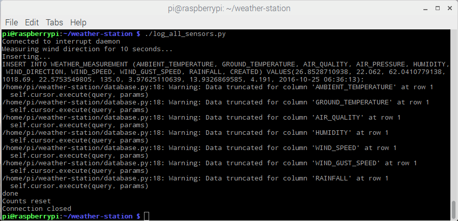
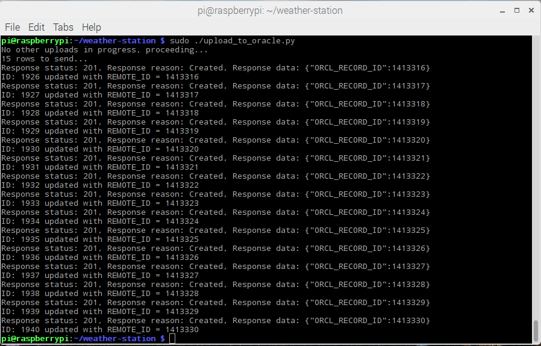
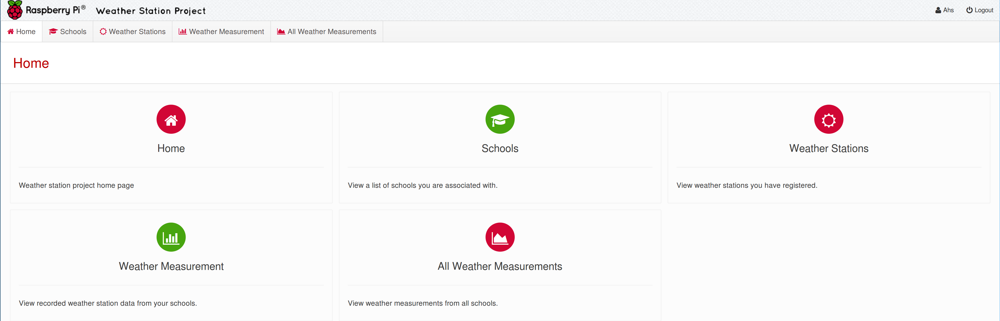
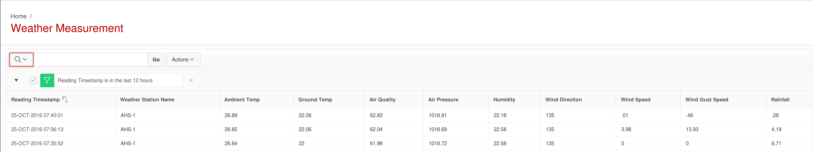
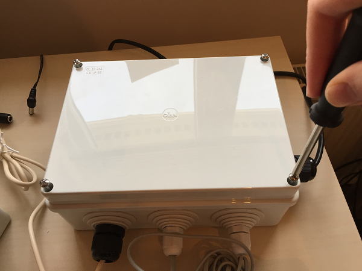

## Test your Weather Station


With all your sensors connected, it's a good idea to confirm that your Weather Station is recording data and that it is able to upload it to the Oracle database.

### Manipulate and measure the sensors

1. The anemometer and rain gauge can be manipulated as neither will be recording data unless they are physically moved. If you spin the anemometer and tilt the rain gauge back and forth a few times while you follow the next set of instructions, some data will be logged.

1. Open a terminal window (<kbd>Ctrl</kbd>+<kbd>Alt</kbd>+<kbd>T</kbd>) and change into the `weather-station` directory:

  ```bash
  cd weather-station
  ```

1. To start logging sensor data, type the following into the terminal window:

  ```bash
  ./log_all_sensors.py
  ```

1. You should see output as shown in the screen capture below.

  

1. Do not worry about the `Data truncated` warnings. The sensors measure to an unrealistic number of significant figures, so these values are truncated before they are added to the database.

### Upload to Oracle

1. Next, you will test that the software can upload the data to the online Oracle database. To test this, type the following into the terminal:

  ```bash
  sudo ./upload_to_oracle.py
  ```

1. You should see output as shown in the screen capture below.

  

1. Each `Response status: 201` message means that a row of the local database on your Raspberry Pi was uploaded to the Oracle database. If you receive a different response code, then check that your Raspberry Pi is connected to the network and that it can communicate through any firewalls or proxy servers that your network may be using.

### Check the online database

1. In your web browser, navigate to the [Oracle database](https://apex.oracle.com/pls/apex/f?p=81290:LOGIN_DESKTOP:0:::::&tz=1:00) and log in:

  

1. On your dashboard, click on **Weather Measurement** to view the latest measurements from your Weather Station.

  

1. Try the different filters and download options with your data, to see what can be achieved.

### What next?

Now that you have tested your Weather Station, close up the boxes with the long screws and ensure that the grommets are in place.

  
