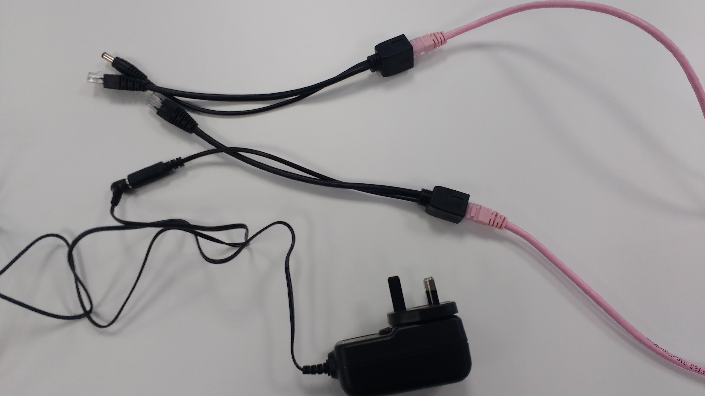

## Install the Weather Station outside


Now you are ready to install your Weather Station. Unplug the keyboard, mouse, and monitor, and seal up the main enclosure to ensure it is watertight.

We’ve mounted stations on walls, rooftops, fences, and even on plumbing pipes stuck in the ground. As long as the sensors are open to the elements, any location is fine. To state the obvious:

- The rain gauge needs to collect rain
- The anemometer and wind vane need to be in the wind
- The air sensor box needs to breathe
- The Weather Station needs to be connected to power and your network via an Ethernet cable or WiFi.

Although we can’t give specific instructions for siting the Station (as the method depends on your particular school and environment), here are some tips for various aspects of the process that should help you get started.


You may not be able to find an ideal location. Perhaps trees block the wind, or the rain gauge is partially sheltered by an overhang.  **Please still install your Weather Station!** You could even use this as a learning opportunity: would it be possible, for example, to take reduced rain readings into account automatically? It’s also a great chance to get your students involved in a bit of problem solving and research, and to get other departments in the school involved.

### Wind sensors

We've made our Weather Station easy to assemble and get up and running, but we know that the trickiest part of setting it up can be installing the equipment outdoors. Since every set-up location is different, it is impossible to create a guide to exactly suit everyone. However, this guide is intended to provide some helpful instructions that you can hopefully adapt to meet your particular needs.

### From where the wind blows

This guide focusses on the wind sensors. The Weather Station kit comes with a weather vane for measuring wind direction and an anemometer to record wind strength. Both of these are connected to the Pi via fairly long cables, so you needn't be constrained by having to fix them close to the box containing the hardware.

   

 A really simple way to mount the wind sensors is to screw them to the edge of a wooden fence or roof. As long as the scoops can spin freely, you will be able to record wind readings, although you may need to adjust your measurements to compensate for the effects of being so close to the flat roof itself. Working out the best way to measure the required adjustment can be an interesting experiment in itself!

###  High (but not dry)

Positioning the instruments a little higher can be cheap and easy: all you need are some readily available plumbing spares from the hardware store to build a mast. Standard polypropylene waste pipes are light, strong, and easy to work with. Even better, a typical 3m length of 40mm diameter pipe is just right for the cables that come with our kits, and a common 22mm diameter pipe is great for mounting the sensors. Of course you don't have to use the full length of pipe if you don't need to.

1. Here's how to make a simple T-shaped mast.

   

2. Measure and mark out a spot approximately 3cm from one end of the 40mm pipe. Clamp the pipe securely in a vice or work bench and then drill a 22mm hole all the way through. Sand off the loose fibres from around the hole.

   

3. Then cut a 30cm length of the 22mm diameter pipe. Simply slide this through the hole in the wider pipe and voila! You've made your T-shaped mast!

   

### Mounting the sensors

4. To attach the weather vane and anemometer to the mast, drill two 5mm diameter holes through the narrower pipe (one at each end) and use a nut and bolt to affix the sensors. Alternatively, if you have access to a 3D printer, you can manufacture some brackets to fix the vane and anemometer even more securely. Either download the [STL files](https://www.thingiverse.com/thing:2360682) for these brackets, or design some yourself!

   
   

5. Before final assembly, thread the sensor cables up through the wider pipe to stop them flapping around in strong gusts.

   

### Mast ahoy!

6. Another great thing about plumbing pipes is that there are plenty of cheap mounting brackets available to help affix your mast to any surface or wall. The side of a wooden shed or hut is ideal but you can also attach the mast to the brickwork of a building.

   

7. Once everything is ready, connect the sensors to the main Weather Station board and test that they are working correctly. It is much easier to adjust a loose cable before hoisting the mast into position! Use cable ties to keep the last few centimetres of cables under control where they emerge from the pipe. This will also provide a 'safety line' for the sensors themselves, should the mounting brackets break (remember that common 3D printing materials have a limited lifespan when exposed to the elements and may require replacing from time to time).

   


There are loads of other ways you could mount your wind sensors - we'd love to see what you come up with: please share your builds with weather@raspberrypi.org

### Connecting to WiFi

We've made our Weather Station easy to assemble and get up and running, but we know that the trickiest part of setting it up can be installing the equipment outdoors. Since every set-up location is different, it is impossible to create a guide to exactly suit everyone. However, this guide is intended to provide some helpful instructions that you can hopefully adapt to meet your particular needs.

This guide focuses on how to connect the Weather Station kit to a WiFi network so that it can upload its data to online databases.

### Power and internet connectivity

The Raspberry Pi Weather Station kit comes with Power over Ethernet (PoE) adapters so that you can connect it up outside using just one cable.

   

However, there are some situations where you might not need or be able to use a networking cable to reach your Weather Station.  For example you might site the kit in an outbuilding such as a storage hut of your school's playing field or on some other kind of shed. These can be good locations as they may be far from tall buildings while having their own power.

### Using WiFi

If you cannot use a networking cable, you could periodically retrieve the Weather Station's SD card and upload its data to the Oracle cloud using another Pi.

Alternatively, you can connect your Weather Station to a WiFi network. The Raspberry Pi 2 in the kit doesn't have built-in WiFi, but you can easily add a WiFi USB dongle. In fact, an external wireless device with a large antenna may be better suited for connecting to a network that is some distance away.

   

### Choosing your site

If you're using WiFi, the most important thing is to minimise any obstacles between your Weather Station and the nearest transmitter. Concrete and metal structures are very good at absorbing WiFi signal. Water is also a fairly good absorber - this can be a factor if there are large plants around: absorption may be minimal in dry conditions or in the winter when there are fewer leave, but could rise dramatically after summer rainfall.

### Optimising your position

The exact position of your WiFi dongle can have a large impact on signal strength. Therefore it is worth spending some time trying to find the optimal place for your Weather Station. You can use the command

 ```bash
 iwlist wlan0 scan
 ```

to display a list of WiFi networks your Pi can see (run this in a terminal window). This command produces a lot of information but the important parameter is 'Quality', reported in the third column.


Remember that  a -60 dbm is a better signal that -70 dbm, and that decibels relative to a milliwatt (dbm) scale *logarithmically*, so that a 3 dbm increase means that the power has doubled.

It is not very easy or efficient to repeatedly run this command while adjusting the position of the Pi or dongle. Instead we can use some nifty Python code and a shell script to display a continually updating readout of the signal strength picked up from your network.

First of all, install the Python helper program.

   ```bash
   sudo pip install iw_parse
   ```

Then to run a continual feed, run this multi-line command in a Terminal window :

 ```bash
   while true
   do
   iwlist wlan0 scan | iw_parse | grep "your ss id"
   sleep 1
   done
```
You will see something like this:

   

While this output is scrolling, adjust the position of your Weather Station or its external dongle to maximise the 'Quality' value.

### Extending the range

Positioning the dongle outside of the Weather Station's housing but inside a reasonably watertight hut or shed gives you a lot more options. Having the dongle on a USB 'extender' lead so that it isn't plugged directly into the Pi's USB port can improve signal. A transceiver with an external antenna can also make a big difference. Common transceivers are omnidirectional and look like a familiar stick aerial. This type of antenna can be a good choice in a location with lots of buildings, as you may benefit from reflected signals.

   

You can also experiment with directional antennae. A small mini-panel can provide large gain but requires more careful adjustment to optimise; due to reflections and other effects, the position with the strongest signal may not always fall on a straight line from the antenna to the transmitter.

If you're feeling particularly creative you could even [build a 'cantenna'](http://www.turnpoint.net/wireless/cantennahowto.html) - a WiFi antenna using an aluminium food can.
